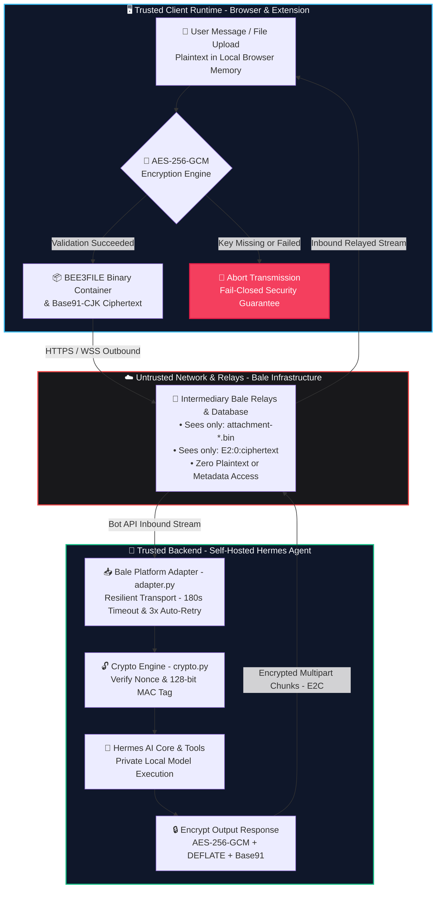

<div align="center">

# 🛡️ Hermes Bale E2EE

### *Zero-Knowledge End-to-End Encryption Bridge for Bale Messenger & Hermes AI Agent*

[](LICENSE)
[](https://en.wikipedia.org/wiki/Galois/Counter_Mode)
[](BEE3FILE_SPEC.md)
[](#-browser-support)
[](https://hermes-agent.nousresearch.com)

<p align="center">
  <b>Hermes Bale E2EE</b> layers zero-knowledge, client-side end-to-end encryption directly on top of the <b>Bale Messenger</b> web platform for private communication with self-hosted <b>Hermes AI Agent</b>.
</p>

[Hermes Quickstart](#-one-prompt-automated-setup-let-hermes-do-it) • [Architecture](#-architecture) • [Wire Inspection](#-wire-inspection) • [Manual Setup](#-manual-setup) • [Cryptographic Spec](#-cryptographic-specification) • [Browser Support](#-browser-support)

---

</div>

## 🤖 One-Prompt Automated Setup (Let Hermes Do It)

If you already have **Hermes Agent** running on your server, simply copy and send the prompt below to your Hermes:

```text
Please install and configure the Bale E2EE platform plugin for me from:
https://github.com/NotMmd/hermes-bale-e2ee

Steps:
1. Clone or copy hermes-plugin/ into ~/.hermes/plugins/platforms/bale/
2. Prompt me for my Bale Bot Token and encryption passphrase
3. Help me retrieve my numeric UID from https://web.bale.ai/chat?uid=...
4. Write BALE_BOT_TOKEN, BALE_ENCRYPTION_KEY, BALE_ALLOWED_USERS, and BALE_HOME_CHANNEL into ~/.hermes/.env
5. Enable platforms.bale in config and restart the gateway
6. Run a crypto round-trip test to ensure everything encrypts and decrypts cleanly
```

---

## 💡 Motivation & Threat Model

The security and privacy of Iranian domestic platforms cannot be guaranteed. When using private or cloud AI models over domestic messaging services, sensitive queries, personal notes, and attachments reside in plaintext on intermediary network servers.

**Hermes Bale E2EE** solves this at the application layer without requiring platform modifications:
- **Zero-Knowledge by Design:** All texts, images, and documents are encrypted locally inside browser memory before transmission.
- **Fail-Closed Guarantee:** If a key is missing or encryption fails, dispatch is immediately halted. Plaintext is never transmitted.
- **Zero Platform Modification:** Operates via standard Web Extensions without requiring dangerous APK decompilation, runtime hook tampering, or bypassing banking app signature checks.

---

## 🏗️ Architecture & Data Flow



---

## 🔍 Wire Inspection: What Intermediaries See

Intermediary servers and network eavesdroppers see zero plaintext:

### 💬 Text Messages

```text
# Plaintext (Client & Hermes Agent only):
"Hey Hermes! Can you analyze this financial report and summarize key points?"

# What Bale Servers and Eavesdroppers See:
"E2:0:僮娠崍剧夝呎厚岉呿剤吤嘢囇嶢凫屗偛剤吤嘢剠呯勔咻咲峍勬埠堜偯墸嵵凞唃峿作剤吤嘢"
```

### 📁 Media & Attachments (BEE3FILE v1)

```text
# Real File:
financial_report_q3.pdf (4.8 MB, application/pdf)

# What Bale Servers Receive:
Filename:   attachment-a7b767977cda882c.bin
MIME Type:  application/octet-stream
Magic Byte: 42 45 45 33 01 (BEE3 v1 Container)
Payload:    [ Encrypted Metadata Header + Ciphertext Stream + 128-bit MAC Tag ]
```

---

## ✨ Key Features

- **🔐 Authenticated Encryption:** High-speed `AES-256-GCM` provides confidentiality and tamper detection on every packet.
- **🏮 Compact CJK/Base91 Encoding:** Reduces ciphertext bloat by ~40% compared to standard Base64, keeping payloads compact and resilient.
- **🧩 Multipart Streaming (E2C):** Automatically slices long AI responses exceeding Bale's 4,096-character limit into ordered encrypted chunks (`E2C:idx/total:...`) and reassembles them smoothly on the client.
- **📦 BEE3FILE v1 Container:** Encapsulates files, images, voice notes, and documents. Completely conceals original filenames, extensions, and file sizes.
- **⚡ Resilient File Limits (Default 20MB):** Defaults to 20MB (configurable via `BALE_MAX_FILE_SIZE_MB`), backed by a 3x exponential backoff retry engine and 180s socket timeouts to handle Bale server congestion, latency spikes, and network drops.
- **📱 Universal Compatibility:** Runs on desktop browsers (**Google Chrome**, **Microsoft Edge**, **Brave**, **Vivaldi**, **Firefox**) and mobile Android (**Vivaldi on Android**, **Kiwi Browser**, **Lemur Browser**, **Firefox Nightly**) without rooting or modifying APKs.

---

## 🛠️ Manual Setup

### 1. Hermes Agent Backend Setup

1. Clone and copy the platform plugin into your Hermes installation:
   ```bash
   git clone https://github.com/NotMmd/hermes-bale-e2ee.git
   mkdir -p ~/.hermes/plugins/platforms/bale
   cp -r hermes-bale-e2ee/hermes-plugin/* ~/.hermes/plugins/platforms/bale/
   ```

2. Retrieve your numeric **UID** from [Bale Web](https://web.bale.ai):
   - Open Bale Web in your browser.
   - Click on your **Saved Messages** (پیام‌های ذخیره شده) or any bot chat.
   - Look at the browser URL bar:
     ```text
     https://web.bale.ai/chat?uid=1234567890
     ```
   - Copy the numerical value after `?uid=`. This is your unique account identifier.

3. Configure your Hermes environment variables (`~/.hermes/.env`):
   ```dotenv
   # Bale Bot Token (obtained from @BotFather in Bale)
   BALE_BOT_TOKEN="your_bot_token_here"

   # Shared Symmetric Passphrase (shared with your browser extension)
   BALE_ENCRYPTION_KEY="your-strong-random-passphrase"

   # Security Whitelist (Numeric UID copied from Bale Web URL)
   BALE_ALLOWED_USERS="1234567890"
   BALE_HOME_CHANNEL="1234567890"

   # Maximum File Size in MB (Default: 20MB)
   BALE_MAX_FILE_SIZE_MB="20"
   ```

4. Enable the Bale platform in Hermes and restart the gateway:
   ```bash
   hermes config set platforms.bale.enabled true
   hermes gateway restart
   ```

---

### 2. Client Web Extension Setup

> 📦 **Download Ready-to-Use Extension:** You can grab the pre-packaged extension directly from the **[Releases](https://github.com/NotMmd/hermes-bale-e2ee/releases)** section (`hermes-bale-e2ee-extension.zip`) without needing to clone or build the repository manually.

#### On Desktop (Chrome / Edge / Brave / Vivaldi / Firefox):
1. Download and unzip `hermes-bale-e2ee-extension.zip` from [Releases](https://github.com/NotMmd/hermes-bale-e2ee/releases) (or clone and point to the `extension/` directory).
2. Open your browser's extension settings (e.g., `chrome://extensions` or `vivaldi://extensions`).
3. Turn on **Developer Mode**.
4. Click **Load unpacked** and select the extracted folder.
5. Click the **Hermes Bale E2EE** extension icon in your toolbar, enter the exact same **Passphrase** you set in `BALE_ENCRYPTION_KEY`, and save.
6. Open [web.bale.ai](https://web.bale.ai) — all incoming messages and files will decrypt on-the-fly with a green shield indicator.

#### On Mobile (Android via Vivaldi / Kiwi Browser):
1. Install **Vivaldi Browser** or **Kiwi Browser** from the Google Play Store (both provide native extension support on Android).
2. Download the pre-built **`hermes-bale-e2ee-extension.zip`** directly from the **[Releases](https://github.com/NotMmd/hermes-bale-e2ee/releases)** section.
3. Open extension settings (e.g. `vivaldi://extensions` or `kiwi://extensions`), toggle **Developer Mode** on.
4. Tap **Load unpacked** (or **+ from .zip / dir**) and select the downloaded zip file directly.
5. Configure your passphrase in the popup and browse [web.bale.ai](https://web.bale.ai).

---

## 🔒 Cryptographic Specification

| Attribute | Specification | Implementation Notes |
| :--- | :--- | :--- |
| **Symmetric Cipher** | `AES-256-GCM` | NIST SP 800-38D compliant with 128-bit auth tags |
| **Key Derivation (KDF)** | `SHA-256 / PBKDF2` | Generates 256-bit symmetric keys from user passphrase |
| **Nonce / IV Generation** | 96-bit (12-byte) CSPRNG | Generated uniquely per message and chunk; never reused |
| **Ciphertext Format** | `E2:0:<Base91-CJK>` | DEFLATE compression + high-density unicode mapping |
| **Chunking Protocol** | `E2C:<part>/<total>:<payload>` | Handles responses exceeding Bale's 4,096 char limit |
| **File Container** | `BEE3FILE v1` | Secure container encapsulating filename, mime, and data |
| **File Transfer Cap** | 20 MB (Configurable) | Default 20 MB via `BALE_MAX_FILE_SIZE_MB` with auto-retry |

---

## 📁 Repository Structure

```text
hermes-bale-e2ee/
├── extension/             # Browser Extension (Manifest V3)
│   ├── manifest.json      # Chromium & Firefox compatible manifest
│   ├── page-hook.js       # In-page network interceptor & fail-closed crypto hook
│   ├── content.js         # DOM message decryption & bubble decorator
│   ├── popup.html         # Key configuration popup UI
│   └── popup.js           # Secure local storage key handler
├── hermes-plugin/         # Hermes Agent Platform Plugin
│   ├── plugin.yaml        # Hermes platform plugin definition
│   ├── adapter.py         # Bot API transport, webhook/polling, & chunking
│   └── crypto.py          # Pure Python AES-256-GCM & BEE3 container engine
├── BEE3FILE_SPEC.md       # Technical spec for binary media containers
├── TEXT_E2EE_V2_SPEC.md   # Technical spec for Base91/CJK text and chunking
├── LICENSE                # MIT License
└── README.md
```

---

## 🌐 Browser Support

| Browser | Desktop | Mobile (Android) | Support Status |
| :--- | :---: | :---: | :--- |
| **Google Chrome** | ✅ | — | Fully supported |
| **Microsoft Edge** | ✅ | — | Fully supported |
| **Brave** | ✅ | — | Fully supported |
| **Vivaldi** | ✅ | ✅ | Fully supported (Desktop & Android v8.2+ native extension support) |
| **Opera** | ✅ | — | Fully supported |
| **Firefox** | ✅ | — | Supported via WebExtension MV3 |
| **Kiwi Browser** | — | ✅ | Full Chrome extension compatibility on Android |
| **Lemur Browser** | — | ✅ | Full Chromium extension support on Android |
| **Firefox Nightly** | — | ✅ | Supported via Custom Add-on Collection |

---

## 📄 License

This project is licensed under the [MIT License](LICENSE).

---
<sub>vibecoded with ai</sub>
